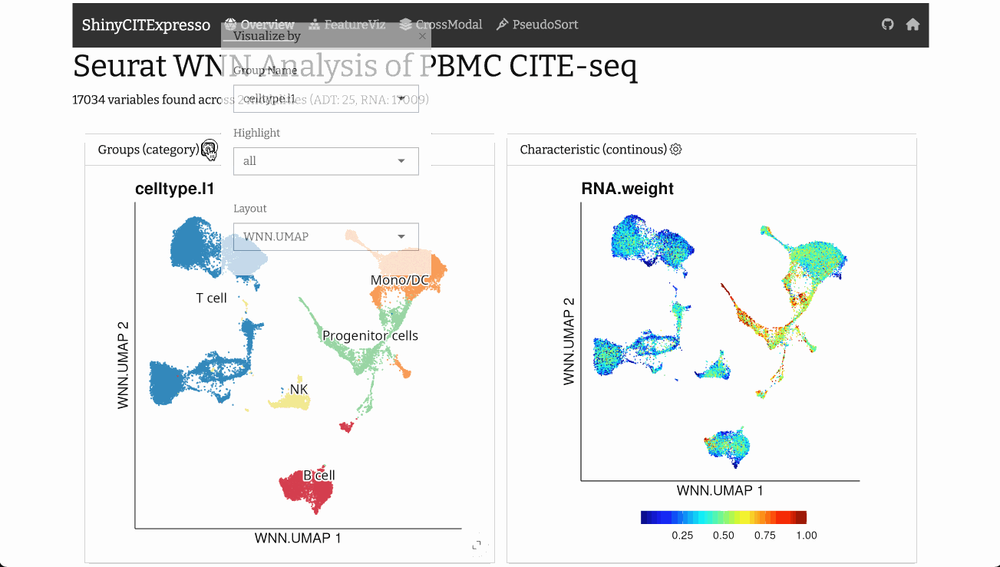
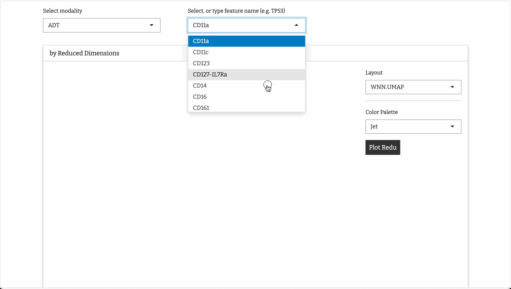
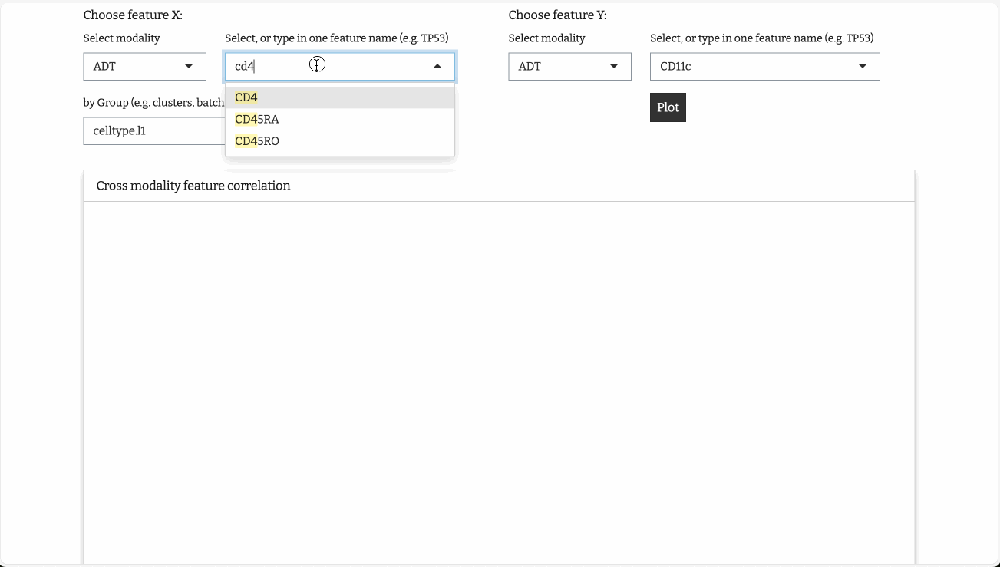
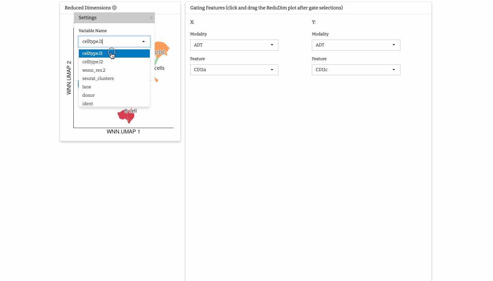

# ShinyCITExpresso


The `ShinyCITExpresso` R package provides a web application based on
[Shiny](https://shiny.posit.co/) and
[bslib](https://github.com/rstudio/bslib/) for visualization CITE-seq
multiomics data:

- Supports
  [MultiAssayExperiment](https://waldronlab.io/MultiAssayExperiment/index.html)
  objects

- Runs on [Rstudio Desktop](https://posit.co/download/rstudio-desktop/),
  or online platforms supporting [Shiny
  Server](https://posit.co/products/open-source/shinyserver/)

- Designed to integrate results from diverse CITE-seq analysis pipelines, including:

  - [Bioconductor](#singlecellexpeiment)
  - [Seurat](#seurat)
  - [MuData](#mudata)

## Navigating Cellular Data: A Visual Journey



## Tailored Insights: Visualizing Custom Features



## Harmonizing Signals: Understanding Cross-Modality Correlation



## Virtual Flow Cytometry: Decoding Pseudo FACS




## Installation

Install Dependencies:
``` r
install.packages(c("devtools", "BiocManager"))
``` 

```r
install.packages(c("dplyr", "ggrepel", "magrittr", 
"plyr", "ggplot2", "RColorBrewer","shiny", "waiter", "bslib", "bsicons"))
```

```r
BiocManager::install(
  c("SummarizedExperiment", "BiocGenerics",
    "SingleCellExperiment", "MultiAssayExperiment",
    "HDF5Array")
)
```


Install the `ShinyCITExpresso` package from Github as follows:

``` r
devtools::install_github("zqzneptune/ShinyCITExpresso")
```

## Quick demo

Access live demo [here](https://www.citexpresso.net/shinydemo/), and explore results from Seurat WNN (Weighted Nearest Neighbor) analysis of 30,672 scRNA-seq profiles measured alongside a panel of 25 antibodies from bone marrow ([Stuart*, Butler* et al, Cell 2019](https://www.cell.com/cell/fulltext/S0092-8674(19)30559-8)). 


## Get started

Select object type to get started with your own data:

### MuData

Results from [CITE-seq analysis with totalVI](https://docs.scvi-tools.org/en/stable/tutorials/notebooks/multimodal/totalVI.html) and [Processing and integrating 5k PBMCs CITE-seq data using moun](https://muon-tutorials.readthedocs.io/en/latest/cite-seq/1-CITE-seq-PBMC-5k.html) are `*.h5mu` format, which can be converted into [MultiAssayExperiment](https://waldronlab.io/MultiAssayExperiment/index.html) objects for `ShinyCITExpersso` using the R package [MuData](https://github.com/ilia-kats/MuData/)

```r
maeObj <- MuData::readH5MU("cite.h5mu")
ShinyCITExpresso::run_app(mae = maeObj)
```

### Seurat

Results from [Seurat Weighted Nearest Neighbor Analysis](https://satijalab.org/seurat/articles/weighted_nearest_neighbor_analysis) can be converted into [SingleCellExperiment](https://bioconductor.org/packages/release/bioc/html/SingleCellExperiment.html) object first:

```r
library(Seurat)

seuObj <- readRDS("cite.RDS")

sceObj <- as.SingleCellExperiment(seuObj)
```

### SingleCellExpeiment

[SingleCellExperiment](https://bioconductor.org/packages/release/bioc/html/SingleCellExperiment.html) object stores additional modality in `altExp` slot, which can be extract to construct [MultiAssayExperiment](https://waldronlab.io/MultiAssayExperiment/index.html) object:

```r
library(SingleCellExperiment)

fnMain <-
  mainExpName(sceObj)
fnAlt <-
  altExpNames(sceObj)  

altSCE <-
  altExp(sceObj)
  
altExp(sceObj) <-
  NULL

assay_list <-
  list(sceObj, altSCE)
  
names(assay_list) <-
  c(fnMain, fnAlt)
  
datColData <-
  colData(sceObj)

maeObj <- 
  MultiAssayExperiment::MultiAssayExperiment(
    experiments = ExperimentList(assay_list),
    colData = datColData
  )
ShinyCITExpresso::run_app(mae = maeObj)
```

## Code of Conduct

Please note that the `ShinyCITExpresso` project is released with a
[Contributor Code of
Conduct](https://github.com/zqzneptune/ShinyCITExpresso/blob/main/code_of_conduct.md).
By contributing to this project, you agree to abide by its terms.

## FAQ
- *Q. There are multiple layers of feature data in `cite.h5mu`, why only one layer can be visualized? Can I visualize other layers of data, e.g. `denoised RNA`, or `denoised protein`?*

To simplify matters, `ShinyCITExpresso` opts to display the first available layer in the object. For `AnnData`, the `X` layer is commonly used. To visualize other layers, one can manipulate the `MAE` object by retaining either the `denoised RNA` or `denoised protein` in the assay slot:
  
```r
library(SingleCellExperiment)
maeObj <-
  MuData::readH5MU("cite.h5mu")

# A MultiAssayExperiment object of 3 listed
#  experiments with user-defined names and respective classes.
#  Containing an ExperimentList class object of length 3:
#  [1] protein: SingleCellExperiment with xxxx rows and xxxx columns
#  [2] rna: SingleCellExperiment with xxxx rows and xxxx columns
#  [3] rna_subset: SingleCellExperiment with xxxx rows and xxx columns

# Choosing denoised_protein for the first Experiment: protein
assays(maeObj[[1]]) <-
  assays(maeObj[[1]])[["denoised_protein"]]
  
# Choosing denoised_protein for the third Experiment: rna_subset
assays(maeObj[[3]]) <-
  assays(maeObj[[3]])[["denoised_rna"]]

# Then Run ShinyCITExpresso
ShinyCITExpresso::run_app(mae = maeObj)
```
